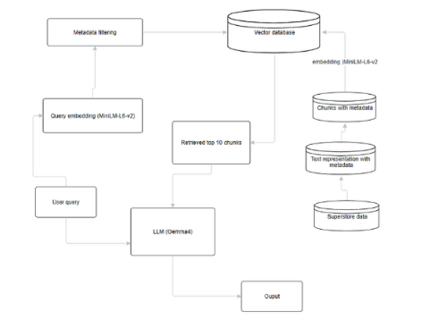

**if any of the files fail to render on github as they are too big for the size that github allows (especially data_preparation_final.ipynb), please download to view its content**

# RAG project

This is a project done in the context of the Data warehousing and Business intelligence course during the Spring 2026. It works with Sample superstore data from the US that spans from 2014 to 2017. The system takes this row data, transforms it accordingly into different textual representations, and tests different chunking strategies. The most optimal chunking strategy found and used is the fixed-size with 1000 characters strategy. 

The documents are then embedded and stored with the corresponding metadata into the ChromaDB vector database using the MiniLM-L6-v2 model. Two different fetching functions are used and compared: similarity_search which retrieves all the documents that are relevant to the query, and metadata_filtering which comes to filter the returned documents based on the provided filter. The best results were obtained using the metadata_filtering approach and it is therefore the final selected method. The queries were embedded using the same embedding function.

Two different LLMs were used: Mistral and Gemma4 all provided through Ollama. Mistral provided average results and struggled with logic while Gemma4 showcased a strong performance across all queries, making it the final choice for the LLM. 

The pipeline is as follows: 
<p align="center">
  
</p>

# Files structure 
main_folder:
    Sample_Superstore.csv
    data_preparation_final.ipynb
    rag_pipeline_final.ipynb
    requirements.txt
    json_files2: (after running data_preparation_final.ipynb)
        category_info.json
        chunks_500.json
        chunks_1000.json
        chunks_2000.json
        city_info.json
        combined.json
        monthly_sales.json
        region_info.json
        state_info.json
        stats_summary.json
        subcategory_info.json
        textual_representation.json
        year_sales.json

# Requirements 
```
chromadb==1.5.8
ollama==0.6.1
pandas==2.3.1
sentence-transformers==5.2.0
```

# How to run it

1. Clone the repository (make sure that the files and the data file are in the same folder)
2. Install the dependencies
```bash
pip install -r requirements.txt
```
3. Install Ollama from https://ollama.com and open it
4. Run the data_preparation_final.ipynb file for the data preprocessing and textual representation creation
5. Run the vector database setup in rag_pipeline_final.ipynb . In the case where you want to repopulate the vector database after already populating it once, you can uncomment:
```bash
chroma_client.delete_collection(name="project")
```
6. Pull Mistral from Ollama using the terminal in your directory and the command:
```bash
ollama pull mistral
```
7. Run Mistral from Ollama using the terminal in your directory and the command
```bash
ollama run mistral
```
8. Run the "RAG Pipeline Implementation - Mistral Approach" section from rag_pipeline_final.ipynb
9. After it is done, click on CTRL+D to stop mistral from running in your terminal
10. Pull Gemma4 from Ollama using the terminal in your directory and the command:
```bash
ollama pull gemma4
```
11. Run Gemma4 from Ollama using the terminal in your directory and the command
```bash
ollama run gemma4
```
12. Run the "RAG Pipeline Implementation - Gemma4 Approach" section to get the results with Gemma4
13. Run the FINAL FULL PIPELINE PERFORMANCE ON QUERIES section to get the final results on each of the chosen queries.

# Example queries and output 

* Query 1: How does the West region compare to the East in terms of profit?

Answer : The West region has a higher profit compared to the East region, with a total profit of **$108418.45** compared to the East region's total profit of **$91522.78**.

Justification: The question asks for a comparison of profit between the West and East regions. I located the profit data for both regions in the provided context. For the West region, the total profit is stated as **$108418.45**. For the East region, the total profit is stated as **$91522.78**. By comparing these two figures, $108418.45$ is greater than $91522.78$, indicating that the West region has a higher profit.

* Query 2: What is the sales trend over the 4-year period?

Answer : The sales trend over the 4-year period (2014 to 2017) shows an initial slight decrease followed by a strong upward trajectory. Sales started at $484,247.5 in 2014, dipped slightly to $470,532.51 in 2015, and then increased significantly to $609,205.6 in 2016, culminating in the highest sales figure of $733,215.26 in 2017.

Justification: The question asks for the sales trend over the 4-year period, and the context provides data for 2014, 2015, 2016, and 2017. To determine the trend, I must analyze the sales figures chronologically. The sales for 2014 were $484,247.5. The sales for 2015 were $470,532.51, which is a decrease from 2014. The sales for 2016 were $609,205.6, which represents a substantial increase from 2015. Finally, the sales for 2017 were $733,215.26, which is the highest value and shows a continued upward trend compared to 2016. Therefore, the trend is characterized by an initial dip followed by a strong, continuous increase.

* Query 3: Which product category generates the most revenue?

Answer : The product category that generates the most revenue is Technology, with total sales of **$836,154.03**.

Justification: The question asks to identify the product category with the highest revenue, which is represented by the total sales figure for each category. I compared the total sales for the three listed categories: Technology had total sales of $836,154.03; Office Supplies had total sales of $719,047.03; and Furniture had total sales of $741,999.8$. By comparing these three values, $836,154.03$ is the highest number, indicating that the Technology category generated the most revenue.

* Query 4: Which category performs better Technology or Furniture?
  
Answer : Technology performs better than Furniture, showing higher total sales of **$836,154.03** compared to Furniture's total sales of **$741,999.8**, and significantly higher total profit of **$145,454.95** compared to Furniture's total profit of **$18,451.27**.

Justification: The question asks to compare the performance of Technology and Furniture. I analyzed the provided metrics for both categories: Total Sales, Total Profit, Number of Orders, and Mean Discount. To determine which category performs better, I compared the primary performance indicators, Total Sales and Total Profit. For Total Sales, Technology recorded **$836,154.03**, which is higher than Furniture's **$741,999.8**. For Total Profit, Technology recorded **$145,454.95**, which is substantially higher than Furniture's **$18,451.27**. Although Furniture had a higher number of orders (**2121**) compared to Technology (**1847**), the superior performance in both total sales and, more critically, total profit indicates that Technology is the better performing category.

* Query 5: which region has the highest sales?
  
Answer : The West region has the highest sales with a total of **$725,457.82**.

Justification: The question asks to identify the region with the highest sales based on the provided context. I extracted the total sales for each region: East had $678,781.24, South had $391,721.91, West had $725,457.82, and Central had $501,239.89. By comparing these four values, $725,457.82$ (West) is the largest number, indicating that the West region has the highest sales.

# Limitations 
- Struggles with tasks such as cities ranking due to the large number of documents that need to be retrieved
- Dependent on the filter used when filtering the returned chunks
- Each query is independent
- Struggles with queries that require information from different areas at the same time
- Require large amount of storage and RAM for Gemma4
